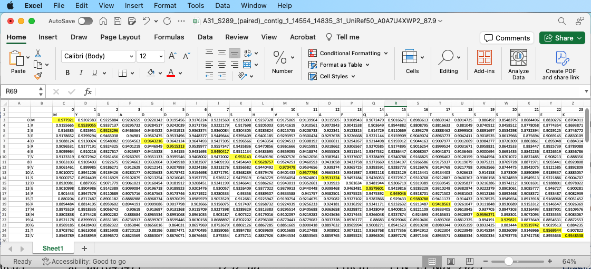

# Soft Alignment of Protein Embeddings

### About This Repository


This repository hosts the implementation of the soft alignment
algorithm as presented in the paper "Large Language Models, Protein
Homology, Viruses, Alignments" by Harrigan et al. The primary purpose
of this repository is to facilitate a deeper understanding and
application of the concepts discussed in the paper through practical,
executable code examples.

This repository contains various scripts, including the `soft_align.py`
script implements the core functions of the soft alignment
algorithm. This file is essential for anyone looking to directly apply
or further explore the algorithmic approach detailed in the paper.

In addition to the `soft_align.py` script, this repository offers two Jupyter notebooks that serve as comprehensive guides to using soft alignment.

### Quick Interactive Demo

The script `interactive_test.ipynb` provides the steps necessary to compute the soft alignment between two sequences by utilizing embeddings generated by ESM2.

The most important step in running a soft alignment between two sequences are summarized below


```python
import os
from Bio import SeqIO # needed to read in the fasta sequences
import torch 	      # needed to compute the similarity matrix
from soft_align import get_data_matrix, get_matches, get_longest_path
```


```python
# Specify the directory paths where sequence embeddings and FASTA sequences are stored

embedding_directory = './soft_align_example_data/example_embeddings/'
fasta_directory = './soft_align_example_data/'
fasta_file = 'example.fasta'

seqs = SeqIO.to_dict(SeqIO.parse(os.path.join(fasta_directory, fasta_file), 'fasta'))

# Create a list of sequence names
seq_names = list(seqs.keys())
print(seq_names)
```
```
OUTPUT:  ['YP_006990334.1', 'YP_001468397.1', 'WP_016056174.1']
```

```python
# Create string representations of the sequences being compared

seq_1_str =  str(seqs[seq_names[0]].seq)
seq_2_str =  str(seqs[seq_names[1]].seq)

# Create a dictionary containing the embeddings of the sequences
# Sequence name and representation are stored in the dictionary

seq_1_embedding = torch.load(f"{embedding_directory + seq_names[0]}.pt")
seq_2_embedding = torch.load(f"{embedding_directory + seq_names[1]}.pt")

# Generate a matrix containing cosine distances of amino acid embeddings from sequence representations
data = get_data_matrix(seq_1_embedding,seq_2_embedding)
data.iloc[0:5, 0:5]
```
```
OUTPUT:
```
<div>
<table border="1" class="dataframe">
  <thead>
    <tr style="text-align: right;">
      <th></th>
      <th>0</th>
      <th>1</th>
      <th>2</th>
      <th>3</th>
      <th>4</th>
    </tr>
  </thead>
  <tbody>
    <tr>
      <th>0</th>
      <td>0.947351</td>
      <td>0.838340</td>
      <td>0.865979</td>
      <td>0.830881</td>
      <td>0.826368</td>
    </tr>
    <tr>
      <th>1</th>
      <td>0.866956</td>
      <td>0.878017</td>
      <td>0.888858</td>
      <td>0.862527</td>
      <td>0.836949</td>
    </tr>
    <tr>
      <th>2</th>
      <td>0.886032</td>
      <td>0.876636</td>
      <td>0.897953</td>
      <td>0.880396</td>
      <td>0.876158</td>
    </tr>
    <tr>
      <th>3</th>
      <td>0.852143</td>
      <td>0.892888</td>
      <td>0.901820</td>
      <td>0.852618</td>
      <td>0.876243</td>
    </tr>
    <tr>
      <th>4</th>
      <td>0.843087</td>
      <td>0.852053</td>
      <td>0.927681</td>
      <td>0.866988</td>
      <td>0.867131</td>
    </tr>
  </tbody>
</table>
</div>


```python
# Generate matches of amino acids from cosine distance matrix

matches = get_matches(seq_1_str, seq_2_str, data)
longest_path = get_longest_path(data, matches)
longest_path [0:5]
```
```
OUTPUT:  [(0, 0), (3, 1), (4, 2), (5, 3), (6, 4)]
```


### Soft Alignment in Excel Sheet

The notebook `Soft_alignment_cosine_distance_matrix_to_excel.ipynb` illustrates the process of generating soft alignments and effectively visualizing and exporting the results to an Excel spreadsheet.

The python `xlwings` library is needed to run this notebook. Additionally, Excel should be installed and open before invoking the function `build_excel_sheet`. The output generated will be similar to the following:




### Using FAISS to Identify Putative Protein Matches

This repository includes a Python script, `get_nearest_embeddings.py`, designed to refine the process of sequence comparison. This script streamlines the identification of sequences most relevant to a given query. By leveraging [FAISS](https://github.com/facebookresearch/faiss), a library for efficient similarity search, `get_nearest_embeddings.py` allows for the rapid comparison of a query sequence against a database of protein sequence embeddings. This functionality significantly reduces the computational overhead associated with exhaustive sequence comparisons, quickly identifying sequences with the highest potential for meaningful alignments.

To run `get_nearest_embeddings.py`, use the command line interface with the following options:

```
usage: get_nearest_embeddings.py [-h] [--db_embeddings_folder DB_EMBEDDINGS_FOLDER] [--query_embeddings_folder QUERY_EMBEDDINGS_FOLDER] [--with_gpu WITH_GPU]

optional arguments:
  -h, --help            show this help message and exit
  --db_embeddings_folder DB_EMBEDDINGS_FOLDER  Specify the folder containing the database embeddings.
  --query_embeddings_folder QUERY_EMBEDDINGS_FOLDER  Specify the folder containing the query sequence embeddings.
  --with_gpu WITH_GPU   Indicate whether to utilize GPU acceleration.
```
